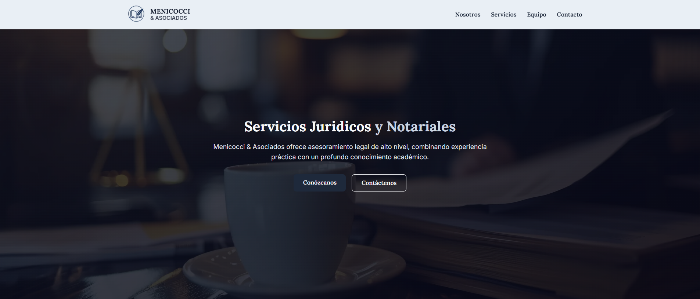

# Menicocci & Asociados — Law Firm Website

Corporate website for a law firm in Rosario, Argentina. Built so the firm can publish and edit its own articles through a headless CMS, with no developer involvement.

**Live site:** https://menicocci-asociados.vercel.app



## Stack

- **Next.js 15** (App Router, Server Components)
- **React 19** + **TypeScript**
- **Sanity** as headless CMS, with custom content schemas
- **Tailwind CSS v4** and CSS Modules
- **Framer Motion** for section animations
- **Portable Text** to render rich content coming from the CMS
- Deployed on **Vercel**

## Features

- **Headless CMS integration** — articles are authored in Sanity Studio and rendered by the site; the client manages content without touching code
- **Dynamic routing** with `articulos/[slug]` for individual articles, statically generated from CMS content
- **Multi-page App Router structure**: home, about, services, team, articles and contact
- **Typed data layer** — `getArticles` and `getArticleBySlug` isolate all CMS queries behind typed helpers
- **Responsive, mobile-first design** across every section
- Reusable components (Navbar, Hero, Testimonials, Footer) shared across routes

## Project structure

```
src/
├── app/              # App Router pages
│   ├── articulos/    #   article list + [slug] dynamic route
│   ├── contacto/
│   ├── equipo/
│   ├── nosotros/
│   └── servicios/
├── components/       # Shared UI (Navbar, Hero, Testimonios, Footer)
├── lib/              # Sanity client and typed content queries
├── sanity/           # CMS configuration and content schemas
└── styles/           # Global styles and CSS Modules
```

## Running locally

```bash
npm install
npm run dev
```

Open [http://localhost:3000](http://localhost:3000).

The Sanity Studio configuration lives in `src/sanity`, with the article schema defined in `src/sanity/schemaTypes/article.ts`.
